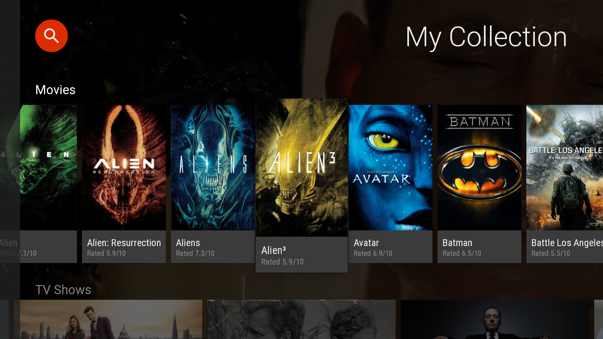
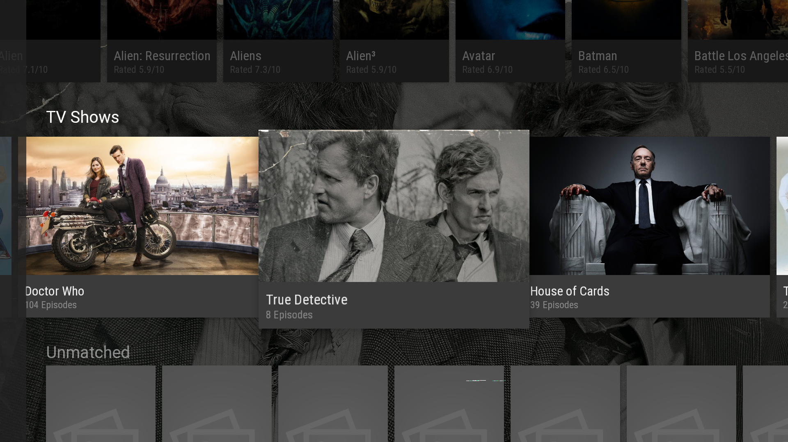

Amphitheatre
============

Amphitheatre is an Android TV project aimed to bring you the best of your content in a simple and visually appealing fashion. It connects to your network shares, organizes and serves videos to an Android capable media player.




**Features**
* Indexes movie and TV show files on your SMB or CIFS shares.
* View movie and TV show poster art and details.
* Quickly search through your video collection.

Dependencies
------------

#### The Movie Database (TMDb)

Amphitheatre uses The Movie Database (TMDb) in order to fetch movie information.

You'll need to sign up as a developer and add your TMDb API Key to your `~/.gradle/gradle.properties`:
```
TMDB_API_KEY=<your api key>
```

#### Media Player

Amphitheatre does not play the actual video file but serves it to a capable media player application. So you'll need to install a media player as well. MXPlayer is a great player worth checking out.

Contributing
------------

All contributions are welcome! 

License
-------

    Copyright 2014 Jerrell Mardis

    Licensed under the Apache License, Version 2.0 (the "License");
    you may not use this file except in compliance with the License.
    You may obtain a copy of the License at

       http://www.apache.org/licenses/LICENSE-2.0

    Unless required by applicable law or agreed to in writing, software
    distributed under the License is distributed on an "AS IS" BASIS,
    WITHOUT WARRANTIES OR CONDITIONS OF ANY KIND, either express or implied.
    See the License for the specific language governing permissions and
    limitations under the License.
